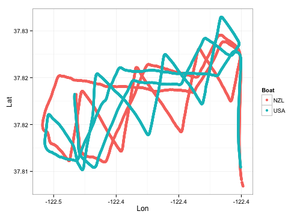

```r
library(ggplot2)
library(plyr)
```


```r
r10 = rbind(read.csv("~/Downloads/130915/csv/20130915133810-NAV-NZL.csv"), read.csv("~/Downloads/130915/csv/20130915133810-NAV-USA.csv"))
```


```r
r10 = subset(r10, Secs > 51960 & Secs < 51960 + 1336)
```


```r
diff0 = function(x) c(0, diff(x))
r10 = ddply(r10, "Boat", function(x) {
    x$LatUnrolled = cumsum(abs(diff0(x$Lat)))
    x
})
```


```r
r10ss = subset(r10, round(Secs * 10)%%1000 == 500)
```


```r
ggplot(
	r10,
	aes(
		-Lon, 
		-LatUnrolled, 
		col = SOG/CourseWindSpeed, 
		shape = Boat)) +
	scale_color_gradient(low="green", high = "red")+
	geom_point() + 
	scale_size_identity() +
	geom_point(
		data = r10ss,
		color = "white",
		alpha = .5,
		size = 4)
```

 


```r
ggplot(r10, aes(-Lon, -LatUnrolled, col = Secs, shape = Boat)) + scale_color_gradientn(colours = c("red", 
    "orange", "yellow", "green", "blue", "violet")) + geom_point() + scale_size_identity() + 
    geom_point(data = r10ss, color = "white", alpha = 0.5, size = 4)
```

 


```r
ggplot(
	r10,
	aes(
		(Hdg - CourseWindDirection)%%360, 
		SOG/CourseWindSpeed, 
		color = Secs)) +
	scale_x_continuous(
		"", 
		limits=c(0,360),
		breaks=seq(0,360-1,by=30),
		labels=c("In Irons", "Close Hauled", "Close Reach", "Beam Reach", "Broad Reach", "Running", "Running", "Running", "Broad Reach", "Beam Reach", "Close Reach", "Close Hauled")
		) +
	scale_y_continuous("y", limits = c(0,2.7)) +
	coord_polar() + 
	scale_color_gradientn(colours=c("red", "orange", "yellow", "green", "blue","violet"))+
	geom_jitter(alpha = .2) + 
	facet_grid(.~Boat)
```

 


```r
r10sl = subset(r10, abs(diff0(filter(Hdg, rep(0.01, 100)))) < 1)
ggplot(r10sl, aes(SOG/CourseWindSpeed, color = Boat)) + geom_density()
```

 

```r
ggplot(r10sl, aes((Hdg - CourseWindDirection)%%360, color = Boat)) + scale_x_continuous("", 
    limits = c(0, 360), breaks = seq(0, 360 - 1, by = 30), labels = c("In Irons", 
        "Close Hauled", "Close Reach", "Beam Reach", "Broad Reach", "Running", 
        "Running", "Running", "Broad Reach", "Beam Reach", "Close Reach", "Close Hauled")) + 
    geom_density()
```

 

