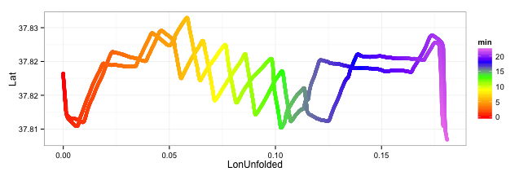
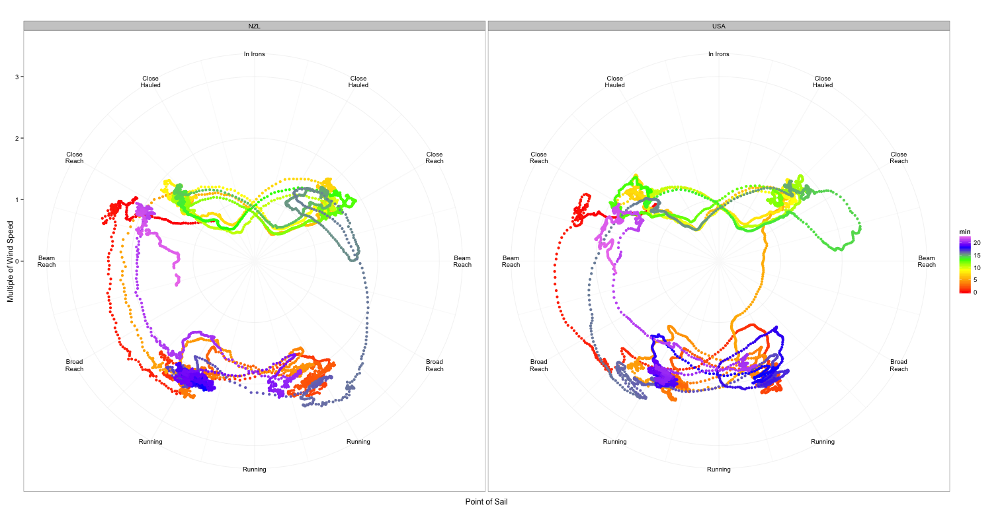
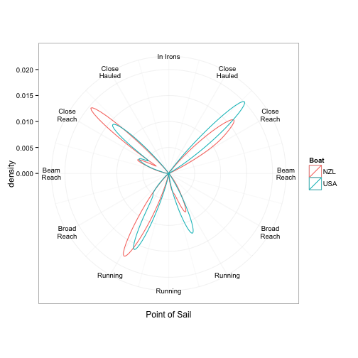

# The greatest sailboat race of all time seen through statistical graphics

I don't know if you've been following the [America's Cup](http://americascup.com). It's the oldest sailing competition and, by some accounts, the oldest international sporting event bar none. This year, this time honored contest has been thrust into the modern age with the adoption of foiling winged catamarans that skim the water of San Francisco Bay at 90 Km/h. Not only that, the competition has also entered the Big Data age with 30,000 data points per second generated by onboard sensors, not to mention the multiple video feeds, the enhanced reality visuals and more.

The prospect of having some of that data made available to the general public was mouth watering. It turns out that for one race what is shared is a paltry 14,000 records and all the columns corresponding to on board instruments contain only zeros and America's cup data engineers have confirmed the omission is necessitated by the rules. But what's there already tells the story of the race in quite some depth.

I wanted to build some high density graphics that showed the crucial events of the race. Some of answers offered by the graphics would need to be confirmed by more rigorous statistical methods but we will stop short of that in this article. The first graphics is going to be based on the course followed by the boats and this is what happens just plotting their longitude and latitude, captured 5 times per second:

 

Since the race goes back and forth three times in between two gates, the overlap of the yachts' trajectories makes this first visualization hard to read, so I decided to mirror the Longitude every time the sailboats reach a *mark* (sailing speak for turn around point). Imagine the race course as a folded piace of paper and the visualization as its unfolded version, with the creases in the north-south direction at the marks. Being a race, speed matters, so I decided to use color to represent it. Since in sailing "fast" is only relative to the wind, I learned to use the ratio of boat speed to wind speed from America's Cup commentators, accomplished sailors Gary Jobson and Ken Read. In Race 10 this ranged between 0.5 on some not-so-good tacks (upwind turns), when the boat is briefly traveling against the wind, to 2.7. Symbols are used to identify the boats. A nice side effect of this is that the symbols show the position of the boats at regular time intervals, suggesting which one is ahead particularly near a cross. In sailing, speed is not everything: equally important is angle w.r.t the wind, since sailboats can't go straight upwind and can go straight downwind only paying a massive speed penalty, and the course is roughly aligned with the wind. The combination of speed and angle is called *velocity made good*, or VMG. As for raw speed, what a good VMG is depends on the intensity of the wind, so it makes sense to take the ratio of VMG to wind speed, which I call *relative VMG* or RVMG. In the following graphics, this is expressed as thickness of the line. To summarize, the next graphics shows the trajectory of the two boats with the twist that the race course is replicated three times and mirrored as needed to avoid overlaps; color is speed and thickness is RVMG; symbols identify the boats and their position at regular time intervals. 

 

If you watched this fantastic race, hailed as one of the greatest sailing contests to ever take place, you can recognize all of its decisive moments in this graphic. The race started with a very fast reach, with team New Zealand (NZL) pushing team USA (USA) wide at the first mark rounding. USA has a difficult *jybe* (turn going downwind) as their line turns green, unlike NZL's. The two boats go in sync down to mark 2, with USA following a closer angle for one tack, not sure why. At the Mark USA goes for a complicated manouver to obtain a split &mdash; a split is always preferred by the chaser, as these boats always leave a wake of disturbed air behind them, irrespective of wind, so great is their speed &mdash; but the manouver costs them dearly in boat speed. In the upwind leg, the boats seem happy to criss-cross paths as the leader doesn't make a defensive tack over their opponent, probably mindful that a similar move cost them almost a capsize in a previous race. The problem is that tacks require a lot of work and the crews can only produce so many tacks before getting exhausted. Peaks in speed at the crossings show the boat on port tack taking evasive manouver to avoid collision, while the one on starboard tack, with the right of way, tries to make it hard on the other boat, but there are no clear *dial downs* as in other races, when the right of way boat takes aim at the other. Right before mark 3, the two boats part ways: USA ducks deeply behind NZL whereas NZL slows down heading upwind and goes into the mark rounding with a zig-zag. USA speed seems to suffer after the last tack and they go into the dowind leg with a slight deficit, but with the split. At the first cross, a decision looms between ducking (and losing ground) or jybing (losing the split). As USA tactician Ainslie later exlained, neither looks good, but they duck. NZL is clear ahead at their next crossing and, without major errors, the race is over. USA fails to keep the pressure up though with a poor last mark rounding. 

Now I would like to transition into a different, more abstract visualization, but before doing that I need to show a version of the previous graphics with color representing time.

 

This isn't so interesting *per se* but you need to keep an eye on it to read the next graphics, where time is represented by the same color scale. The next graphics is focused on speed and direction w.r.t the wind, what sailors call *point of sail*. In polar coordinates, imagine the wind coming from above and the boat with its *stern* (back) in the center and its *bow* (front) pointing out. The labels are the traditional names for different points of sail: *in irons* (against the wind), *closed haul* (almost against the wind) and so forth. The distance from the center is boat speed relative to the wind. Color represents time and going back and forth to and from the previous graphic you can associate the different colors with various phases of the race. Each point represents a speed and direction reading, taken five times per second and each boat has a separate panel. As you can see, the points are not randomly scattered. Boats tend to stay on a course that gives them the best VMG most of the time. The biggest exceptions are the blue and purple clusters, which are the beginning and final stretches of the race, which are oriented at almost 90 degrees to the wind and as such VMG doesn't matter there, only speed. So the main six clusters are port and starboard tack, upwind and downwind, and the starting and final reaches. In between these we see connecting lines: roughly horizontally we have tacks (upper half) and jybes (lower half); vertically we have mark roundings. There's a few lines that don't fit any of the above: the acceleration from the start in red and a few "tactical" situation such as NZL zig-zagging before mark 3 (in blue-green) and USA ducking deep (green), how scattered the final run is for USA compared to the tight cluster of points for NZL (in purple) and how more consistent are jybe speeds for NZL. In favor of USA, we may have slightly faster speeds through the tacks, but a different graphics later doesn't confirm this.

 

By promoting speed from a color scale to a more perceptually precise spatial scale, we can gain new insights, like the remarkable speed difference between the two teams rounding mark 2 (in yellow) , how scattered the final run is for USA compared to the tight cluster of points for NZL (in purple) and how more consistent are jybe speeds for NZL. In favor of USA, we can see slightly faster speeds through the tacks.

The problem with this visualization is in the tight clusters of points, that is the straight line mode. It'hard to detect the density of points, that is the time a boat has spent traveling at a certain speed. So let's now drop the individual data points. In the next graph, the density of color red is proportional to the time spent sailing at a certain point of sail and speed. 

 

We can see that, upwind, USA seems to travel a bit more close hauled whereas NZ is a little faster. Impossible to tell by eye who achieved the best compromise. On the donwind side, particularly on starboard, NZL seems to travel as if on tracks, with a very tight cluster of points, probably due to longer starboard tacks. Now for a final set of graphics, we focus on speed and point of sail separately. But since speed without direction does not a race win, let's switch to RVMG. And to avoid mixing apples and oranges, let's try to analyze straight line speed vs speed in the turns. I created a "turn test" based on boat heading moving averages over 10 seconds. The next graphics confirms that the test and  intuition mostly agree on what a turn is.

 

With that available, we can now look at the frequency of different points of sail. A density plot in polar coordinates may look unfamiliar, but the meaning is pretty simple: the furthest a line is from the center, the longer a boat has spent traveling at that point of sail. The first plot is for boats going in a straight line.

 

What we see is that indeed USA sails a bit more close hauled both upwind and downwind. But does it pay off in terms of RVMG? In the next plot, negative RVMG is just RVMG downwind.

 

It seems that USA a slight advantage upwind, but the opposite is true downwind. And what about the turns?

 

Well, it looks like the tacks are pretty even, contrary to the impression created by a previous graphics. Maybe just the worse NZL tack was worse, but overall they seem even with their opponent. But NZL seem to have a slight edge on the jybes, which makes sense because they were the first team to foil (fly over the water) and therefore to practice the foiling jybe, a new type of turn performed keeping both hulls out of the water.

## Materials and Methods

These article was composed in [RStudio](http://rstudio.org), using the rhe R-extended  language, a mix of the [R programming language](http://r-project.org) and the [markdown](http://daringfireball.net/projects/markdown/) markup language integrated with the package [knitr](http:/yihui.name/knitr/
g). The pretty graphics are made possible by the [ggplot2](http://had.co.nz/ggplot2) package. The code is available on [github](https://github.com/piccolbo/ac34/blob/master/race10.Rmd). The [data](http://noticeboard.americascup.com/Race-Data/) is made available by the [America's cup](http://americascup.com) organization. 

